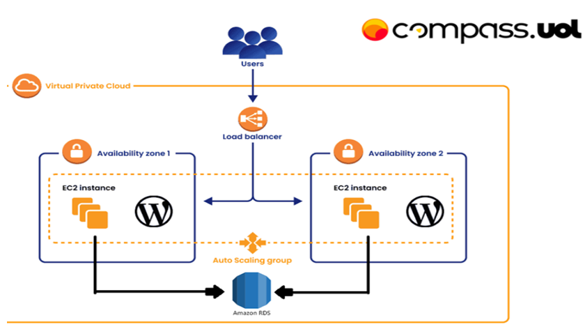

<h1 align="center">
     Compass UOL - DevSecOps
</h1>


## 📌 Descrição do Projeto

Este projeto tem como objetivo configurar e implantar uma aplicação **WordPress** dentro de um contêiner **Docker**, hospedado em uma instância **EC2 da AWS**. A infraestrutura é projetada para ser **escalável** e **segura**, utilizando recursos como **Amazon RDS, EFS e Load Balancer**.

---

## 🏗️ Arquitetura

A arquitetura do projeto segue a tipologia abaixo:



---

## 🛠️ Tecnologias Utilizadas

🔹 **WSL Ubuntu**  
🔹 **Docker**  
🔹 **EC2 com Amazon Linux 2**  
🔹 **RDS MySQL**  
🔹 **EFS para armazenamento**  
🔹 **Load Balancer**  

---

# 📄 Documentação da Infraestrutura AWS para WordPress

## 📌 Passo 0: Configurar a VPC e a Rede na AWS
Antes de instalar o Docker e configurar as EC2, siga este passo a passo para criar uma VPC com sub-redes privadas, NAT Gateway, EFS e Load Balancer.

### 1️⃣ Criar a VPC
No AWS Console, vá para **VPC > Create VPC**

Preencha os dados:
- **Nome:** VPC-WordPress
- **IPv4 CIDR:** 10.0.0.0/16
- **IPv6 CIDR:** Nenhum (opcional)
- **Tenancy:** Default
- **Clique em Create VPC**

### 2️⃣ Criar Duas Sub-redes Privadas
Agora, criamos duas sub-redes privadas em diferentes zonas de disponibilidade.

#### ✔ Criar Sub-rede Privada 1
Vá para **VPC > Subnets > Create Subnet**
- Escolha a VPC criada
- **Nome:** Subnet-Privada-1
- **Zona de Disponibilidade:** Escolha uma AZ (ex: us-east-1a)
- **IPv4 CIDR:** 10.0.1.0/24
- **Clique em Create**

#### ✔ Criar Sub-rede Privada 2
Repita os passos acima:
- **Nome:** Subnet-Privada-2
- **Zona de Disponibilidade:** Escolha uma AZ diferente (ex: us-east-1b)
- **IPv4 CIDR:** 10.0.2.0/24
- **Crie a sub-rede**

### 3️⃣ Criar uma Sub-rede Pública
Essa sub-rede será usada para o NAT Gateway e o Load Balancer.

Vá para **VPC > Subnets > Create Subnet**
- Escolha a VPC criada
- **Nome:** Subnet-Publica
- **Zona de Disponibilidade:** Pode ser qualquer uma
- **IPv4 CIDR:** 10.0.3.0/24
- **Clique em Create**

### 4️⃣ Criar um Internet Gateway
O Internet Gateway permitirá que a sub-rede pública tenha acesso à internet.

Vá para **VPC > Internet Gateways > Create Internet Gateway**
- **Nome:** IGW-WordPress
- **Clique em Create**

Anexe à VPC:
- Vá até **"Actions" > "Attach to VPC"**
- Selecione a VPC criada
- Confirme

### 5️⃣ Criar um NAT Gateway para as Sub-redes Privadas
O NAT Gateway permitirá que as EC2 privadas acessem a internet, sem ficarem expostas.

Vá para **VPC > NAT Gateways > Create NAT Gateway**
- Escolha a **Sub-rede Pública** criada
- **Alocar um Elastic IP** (AWS cria um automaticamente)
- **Clique em Create NAT Gateway**

### 6️⃣ Configurar as Tabelas de Rotas
Agora, configuramos as rotas para cada sub-rede.

#### ✔ Editar Tabela de Rotas da Sub-rede Pública
- Vá para **VPC > Route Tables**
- Encontre a tabela de rotas da **Subnet Pública**
- Adicione uma nova rota:
  - **Destination:** 0.0.0.0/0
  - **Target:** Selecione o **Internet Gateway (IGW-WordPress)**
- **Salve as alterações**

#### ✔ Editar Tabela de Rotas das Sub-redes Privadas
- Vá para **Route Tables**
- Encontre a tabela de rotas da **Subnet Privada 1**
- Adicione uma nova rota:
  - **Destination:** 0.0.0.0/0
  - **Target:** Selecione o **NAT Gateway criado**
- **Repita para a Subnet Privada 2**

Agora, as EC2 privadas terão acesso à internet via NAT Gateway, mas não serão acessíveis externamente.

### 7️⃣ Criar um Security Group
Criamos um Security Group para as instâncias EC2.

Vá para **EC2 > Security Groups > Create Security Group**
- **Nome:** SG-WordPress

#### Regras de Entrada:
- **Porta 22 (SSH):** Apenas da sua rede de administração (ex: MEU_IP/32)
- **Porta 80 (HTTP):** Do Load Balancer
- **Porta 8080 (HTTP):** Do Load Balancer
- **Banco de Dados (3306 - MySQL):** Apenas das instâncias EC2

#### Regras de Saída:
- **Permitir todo tráfego para internet**

---

## 🌐 Criando o Load Balancer

Na AWS, há dois tipos de Load Balancer principais:
1. **Application Load Balancer (ALB)** - Ideal para tráfego HTTP/HTTPS e aplicações distribuídas.
2. **Instance Load Balancer (CLB)** - Distribui tráfego entre instâncias EC2.

### 🔗 Escolhendo e Criando o Load Balancer
Neste projeto, utilizamos um **Application Load Balancer**.

Vá para **EC2 > Load Balancers > Create Load Balancer**
- Escolha **Application Load Balancer**
- **Nome:** wordpress-alb
- **VPC:** wordpress-vpc
- **Subnets:** Escolha as subnets privadas
- **Security Group:** sg-lb

### 🔥 Criando um Target Group
O Target Group define para onde o Load Balancer direciona o tráfego.

Vá para **EC2 > Target Groups > Create Target Group**
- **Tipo:** Instances
- **Protocolo:** HTTP
- **Porta:** 80
- **VPC:** wordpress-vpc
- **Clique em Create Target Group**

Após criar, associe as EC2 ao **Target Group**.

---

## 📈 Criando o Auto Scaling Group
O **Auto Scaling Group (ASG)** permite escalar automaticamente suas instâncias EC2.

Vá para **EC2 > Auto Scaling > Create Auto Scaling Group**

- **Nome:** wordpress-asg
- **Selecionar AMI:** Escolha uma AMI Linux ou Ubuntu.
- **Tipo de instância:** t3.micro (para testes).
- **VPC e Subnets:** private-subnet-1, private-subnet-2
- **Security Group:** sg-wordpress
- **Load Balancer:** Adicione wordpress-alb
- **Target Group:** Escolha o target group criado anteriormente
- **Definir capacidade mínima/máxima:**
  - **Min:** 1
  - **Max:** 3
  - **Desired:** 2
- **Política de Auto Scaling:** Ajustar com base no uso de CPU

---

## 🔑 Criar uma Instância Bastion Host
Como as EC2 do WordPress estão em subnets privadas, precisamos de uma EC2 pública para intermediá-las.

Vá para **EC2 > Launch Instance**
- **Nome:** bastion-host
- **AMI:** Amazon Linux 2
- **Tipo:** t2.micro
- **Rede:** wordpress-vpc
- **Subnet:** Escolha uma subnet pública
- **Habilitar IP Público**
- **Security Group:** Criar um novo `sg-bastion`

### 🔹 Configurar o Security Group das Instâncias WordPress
No Security Group `sg-wordpress`, edite as regras de entrada:
- **SSH (22):** Permitir somente do Security Group do Bastion (`sg-bastion`)

### 🔗 Conectar-se às Instâncias via Bastion Host
Acesse o Bastion Host via SSH:
```bash
ssh -i "minha-chave.pem" ec2-user@IP-PUBLICO-BASTION
```
E, a partir dele, conecte-se às EC2 privadas:
```bash
ssh -i "minha-chave.pem" ec2-user@IP-PRIVADO-EC2
```
---
🚀 Agora sua infraestrutura está pronta e escalável! 🎯
---

## 🎯 Conclusão

Agora sua aplicação **WordPress** está rodando em um ambiente **seguro**, **escalável** e **gerenciado na AWS**, utilizando **Docker, RDS e Load Balancer** para garantir desempenho e disponibilidade. 🚀

---

## 📞 Contato

👩‍💻 **Autor:** Maria Fernanda Trevizane Buonafina  
📩 **E-mail:** [maria.fernanda.ufdc@gmail.com](mailto:maria.fernanda.ufdc@gmail.com)  

🚀 *Happy coding!* 🎉
